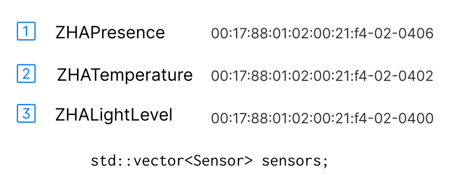
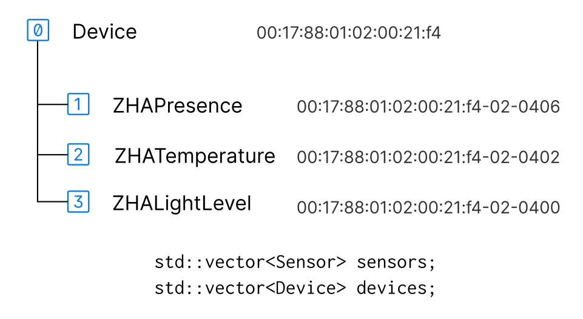

# Device class

<mark>Work in Progress</mark>

The Device class manages a single physical device. It controls *sub-devices* like sensors and lights soley by using their `Resource` and `ResourceItem` interface.

C++ sources: [device.h](https://github.com/manup/deconz-rest-plugin/blob/device_descriptions/device.h) and  [device.cpp](https://github.com/manup/deconz-rest-plugin/blob/device_descriptions/device.cpp)

### Overview

The difference to classic C++ plugin code is best described by an example. The next sections show how a Philips Hue Motion Sensor is handled by classic C++ code vs. the new Device code.

#### Classic C++ code

A Philips Hue Motion Sensor with model identifier "SML001" has three `Sensor` objects. 

<!-- inkscape -d 200 compare-dev-classic.svg  -o compare-dev-classic.png -->
{width=512px}

**Pairing:** The sensors are created and configured by:

```cpp
addSensorNode(const deCONZ::Node *node, const deCONZ::NodeEvent *event);

addSensorNode(const deCONZ::Node *node,
              const SensorFingerprint &fingerPrint,
              const QString &type, const QString &modelId,
              const QString &manufacturer);
              
delayedFastEnddeviceProbe(const deCONZ::NodeEvent *event);

checkSensorBindingsForAttributeReporting(Sensor *sensor);
```

**Operaration:** Once configured, messages from the sensor are processed in:

```cpp
updateSensorNode(const deCONZ::NodeEvent &event);
```

!!! problems
    * The mentioned functions are huge, e.g. `updateSensorNode()` is over 1700 lines long
    * Some parts of the code specifically handle "SML00" modelid
    * There is little error handling and pairing might fail

#### Device code

The new code creates the *same* three sensors, but doesn't use any of the above functions.  
The first notable thing is a hierarchy:

{width=540px}

The Device object is a controller for sensor and light sub-devices. It is created when a ZDP Device Announce command is received.

**Note:** `Sensor` and `LightNode` classes inherit from the `Resource` class, which makes them accessible by the `Device` class.

**Pairing:** During setup the per device [state machine](#state-machine):

* Reads all ZDP descriptors
* Reads ZCL Basic Cluster modelid and manufacturer name
* Passes this data to the [DDF Loader](../ddf-loader) class  
  (which creates the three sensors based on a DDF file)
* Configures all Bindings and ZCL attribute reporting which are defined in the DDF file
* Reads and writes ZCL attributes defined in the DDF file

!!! Remarks
    * The described steps are the same for all devices
    * The state machine handles all errors and faults quickly
    * The involved C++ code knows nothing about a specific device, this is all described in the DDF file. 

The Device class handles sleeping end-devices and routers equally. The knowledge that a device is awake, comes from *Awake* and *Poll Events*, which are generated by external classes and command handlers.

## State Machine

Each Device is driven by its own internal state machine.

The states are implemented as a functions that act on events. The `Device::handleEvent(Event)` method passes the events to the current state, which is internally a function pointer to one of the following state functions:

```cpp
void DEV_InitStateHandler(Device *device, const Event &event);
void DEV_IdleStateHandler(Device *device, const Event &event);
void DEV_NodeDescriptorStateHandler(Device *device, const Event &event);
void DEV_ActiveEndpointsStateHandler(Device *device, const Event &event);
void DEV_SimpleDescriptorStateHandler(Device *device, const Event &event);
void DEV_BasicClusterStateHandler(Device *device, const Event &event);
void DEV_GetDeviceDescriptionHandler(Device *device, const Event &event);
void DEV_BindingHandler(Device *device, const Event &event);
void DEV_BindingTableVerifyHandler(Device *device, const Event &event);
void DEV_PollIdleStateHandler(Device *device, const Event &event);
void DEV_PollNextStateHandler(Device *device, const Event &event);
void DEV_PollBusyStateHandler(Device *device, const Event &event);
```

### High Level View

The following diagram shows the general flow of the state machine. Once the basic setup is done, and the DDF file is processed in the *Get DDF State*, the device enters the *Operating/Idle State*.


The *Operating/Idle State* runs multiple sub states in parallel.

If an error occurs, the state machine jumps back to the *Init State* and starts over from there.
This simplifies error handling, and verifies that every step is processed correctly.

<!--
!!! note
    On deCONZ startup it takes 3--5&nbsp;milliseconds to go from *Init State* to *Operating/Idle State* for an already paired device.
-->

Diagram source: [device_bindings.puml](https://github.com/dresden-elektronik/deconz-rest-plugin-v2/blob/master/arch/diagrams/device_state_machine.puml)

### Timing

Other than internal timeouts, the activation of the state machine is controlled by `REventPoll` events, which are generated per device by the `DeviceTick` class (see [device_tick.h](https://github.com/manup/deconz-rest-plugin/blob/device_descriptions/device_tick.h)).

This is similar to the `PollManager` class in classic plugin code, with the difference that the `DeviceTick` class only controls timing.

### Error handling

The following diagram shows how error handling for ZDP Requests is done in the `DEV_NodeDescriptorStateHandler()` state function, the same principle applies for Active Endpoints and Simple Descriptors states.


Diagram source: [device_state_node_descriptor.puml](https://github.com/dresden-elektronik/deconz-rest-plugin-v2/blob/master/arch/diagrams/device_state_node_descriptor.puml)

### Bindings

ZDP binding and ZCL reporting configuration is maintained during the full life cycle of the device by the *Binding* sub state. If any error or fault happens the state machine recovers automatically and verifies the configuration.

In contrast to classic REST-API C++ code the state machine also detects changes in reporting configuration and is able to apply those.

Each device has it's own copy of binding and ZCL reporting configuration which allows us later to provide custom configuration on a per device base.

Discussion in [issues/6](https://github.com/dresden-elektronik/deconz-rest-plugin-v2/issues/6)

The configuration for bindings and ZCL reporting is specified in DDF files, for example: [ikea/gu10_ws_400lm_light.json](https://github.com/manup/deconz-rest-plugin/blob/device_descriptions/devices/ikea/gu10_ws_400lm_light.json).


Diagram source: [device_bindings.puml](https://github.com/dresden-elektronik/deconz-rest-plugin-v2/blob/master/arch/diagrams/device_bindings.puml)

## Sub-devices

The `Device` class only queries ZDP descriptors and the ZCL Basic Cluster attributes modelid and manufacturer name. After that DDF files are used to create sub-devices like sensors and lights.

Sub-devices are created  by the [DDF Loader](../ddf-loader), **not** the `Device` class itself.

1. When the [Get DDF](#state-machine) state is entered the Device sends the `REventDDFInitRequest` event and waits.

2. The DDF Loader sends a `REventDDFInitResponse` event, at that time all sub device `Resources` and `ResourceItems` are initialized and the `Device` class goes into *Operational/Idle* state.


The [Device Compat](https://github.com/manup/deconz-rest-plugin/blob/device_descriptions/device_compat.cpp) (compatibility) module creates empty `Sensor` and `LightNode` objects and adds them to the respective plugin `sensors` and `nodes` containers. The [DDF Init](https://github.com/manup/deconz-rest-plugin/blob/device_descriptions/device_ddf_init.cpp) module then fills the `ResourceItems` based on the DDF file and registers the `Resource` in the `Device`.

This way the "old" code as well as the `Device` can work side by side, albeit the `Device` doesn't know anything about this.

This process can be repeated at any time, for example during development of DDF files they can be reloaded on-the-fly without restarting deCONZ.

## Testing

Beside loose coupling, the minimal dependencies allow easier testing of the class and its behaviour of the state machine. In general all `Device` code is kept small and has no functions longer than two screen pages (if it does it is a bug). The goal is to get close to 100% test coverage, since internally mostly free standing functions are used this becomes straight forward. Each state and sub states can be tested in isolation as well as complete sequences like device pairing.

First steps to test the Device class behaviour can be found in [001-device-1.cpp](https://github.com/manup/deconz-rest-plugin/blob/device_descriptions/tests/001-device-1.cpp).

## Dependencies

The class depends only on a few other classes and modules. 

- `Resource` as base class and to access sub devices
- `Event` to interact with other components and provide lose coupling
- `deCONZ::Node` to access ZDP Simple Descriptors and Node Descriptor
- [Device Access (DA)](https://github.com/manup/deconz-rest-plugin/blob/device_descriptions/device_access_fn.h) module to execute **abstract** named C++ parse, read and write functions  
  (Examples: [IKEA KADRILJ DDF](https://github.com/manup/deconz-rest-plugin/blob/device_descriptions/devices/ikea/kadrilj_blind.json) and [state/on item](https://github.com/manup/deconz-rest-plugin/blob/device_descriptions/devices/generic/items/state_on_item.json))
- [ZDP](https://github.com/manup/deconz-rest-plugin/blob/device_descriptions/zdp/zdp.h) module to query ZDP descriptors during setup;
- [ZCL](https://github.com/manup/deconz-rest-plugin/blob/device_descriptions/zcl/zcl.h) module to query ZCL *Basic Cluster* attributes during setup.


!!! note
    There are no dependencies to `DeRestPlugin`, `RestNodeBase`, `Sensor` or `LightNode` classes, even `deCONZ::ApsController` is just an opaque pointer.
    All the class sees, is a device which has sub-devices as `Resource` and their `ResourceItems`.

<!-- ## State Change and REST API Functionality

TODO
-->

